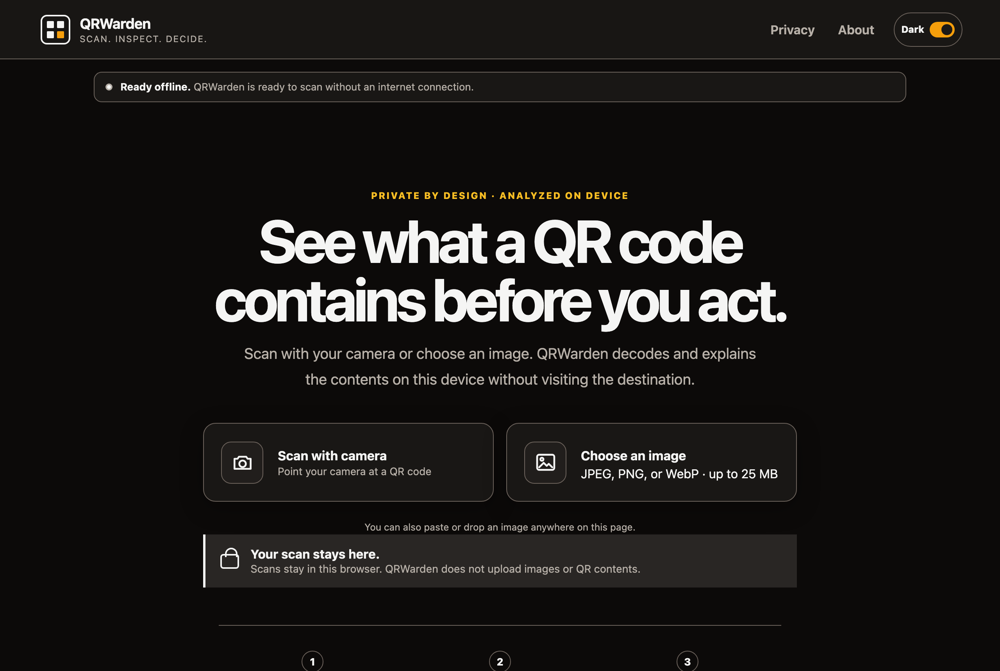

# QRWarden

[](https://github.com/iAnonymous3000/qrwarden/actions/workflows/ci.yml)
[](LICENSE)
[](SECURITY.md)

QRWarden is a pre-release, local-first progressive web app for inspecting QR codes before acting on them. Scans stay in the browser, decoded content is not uploaded, and the app does not visit a destination while analyzing it. It is intentionally a pre-action QR inspector, not a barcode generator, scan history, or automation suite.



## What it does

- Scans QR, Micro QR, rMQR, Data Matrix, and Aztec codes with a camera or from a local image, pasted image, dropped file, or (when installed) the system share sheet.
- Decodes in a disposable same-origin worker with strict input and time limits behind per-symbology canonical-verification profiles.
- Shows decoded content as inert text before offering any action.
- Highlights observable URL, hostname, Unicode, control-character, link-shortener, and payload properties, with a plain-language glossary for every signal.
- Requires explicit confirmation for actions that need additional review, and can copy a redacted plain-text evidence report. The whole-report copy hides decoded or unclassified structured content, structured secrets, URL path segments, and query/fragment names and values; it retains reviewed structure such as origin and host, registrable domain, port, and path/query/fragment presence or counts.
- Works offline after the application shell has been installed and verified.
- Follows the browser language for its interface (English and Spanish).

QRWarden reports evidence, not reputation. It does not label a destination safe, trusted, malicious, clean, or verified.

## Privacy and security model

QRWarden has no account, analytics, telemetry, advertising, scan-history service, or application backend. Inspection does not fetch decoded destinations, redirects, favicons, certificates, DNS answers, previews, or blocklist results.

The implementation uses a bounded decoder worker, an inert renderer, object-bound action handling, strict Content Security Policy, closed production artifacts, hash-pinned analyzer data, and reproducible-build checks. The detailed boundaries and residual risks are documented in [PRIVACY.md](PRIVACY.md) and [THREAT_MODEL.md](THREAT_MODEL.md).

## Project status

### Implemented now

The current source implements the local inspection pipeline, report and action boundaries, installable offline shell, release artifact contracts, and automated source, unit, browser, build, and reproducibility checks. It is still pre-release and is not supported for production use.

### Pending before the first signed public release

The first signed public release is still blocked on real operator-controlled facts and external evidence: name/domain clearance, canonical domain and DNS release-key owner, two maintainer identities, an offline Minisign key, final privacy/operator details, protected release settings, a dated version changelog, independent review, physical-device evidence, the signing ceremony, and a successful deployment/rollback rehearsal. Placeholder values in `release/constants.json` are deliberate development sentinels; they keep ordinary development builds possible, while the release gate rejects them.

Release automation currently stops at an approved unsigned candidate. Offline signing, independent signed-set and attestation verification, draft upload/readback, deployment, and publication are operator-run gates. An automated signed-set finalizer and the deterministic key-transition/recovery statement path are not implemented yet; [RELEASE.md](RELEASE.md) and [SIGNING.md](SIGNING.md) state the current boundary.

## Quick start

The toolchain is locked to Node.js 24.18.0 and npm 11.16.0. Dependencies are exact pins and the committed lockfile is authoritative.

```sh
npm ci --ignore-scripts=false --strict-allow-scripts
npm run dev
```

The committed `.npmrc` makes plain npm installs skip lifecycle scripts. The explicit flags above enable scripts only for the exact reviewed `allowScripts` entries and fail closed on an unclassified hook.

**Toolchain:** `engine-strict` is enabled, so any other Node or npm version fails the install. [CONTRIBUTING.md](CONTRIBUTING.md) shows the exact `nvm` and `fnm` commands for installing the pinned Node 24.18.0 and npm 11.16.0.

Run the full local verification suite for every source or release change:

```sh
npm run validate
npm run build
npm run verify:reproducible
npx playwright install chromium firefox webkit
npm run test:browser
```

`npm run data:generate` deterministically rebuilds the pinned PSL, IANA, and Unicode analyzer modules. It is needed only when reviewing a data update.

## Release engineering

Releases are produced by a fail-closed pipeline. The source is not presented as a signed public release until operator identity, canonical-domain, signing, deployment, and live-verification gates all pass. `npm run release:validate` is the automated local release gate: it requires `git verify-commit HEAD` to succeed against the maintainer's local trust configuration, rejects placeholder release constants, and runs the repository's source, build, reproducibility, unit, release, and browser checks. It does not perform the manual or hosted evidence gates in the release runbook.

```sh
npm run validate:constants:development
npm run validate:constants:release
npm run release:validate
```

The development constants check intentionally accepts the committed sentinel values. The release constants check and `release:validate` reject every placeholder; the latter also requires a locally verifiable signed commit and the complete automated source, artifact, and browser gates.

The production build verifies the reader WASM hash, emits fixed same-origin workers, verifies precache integrity and size, generates route-specific security headers, rejects source maps, and enforces a closed artifact contract. The dispatch-only release workflow adds two independent digest-pinned builds, normalized archives and manifests, an SBOM, a license report, attestations, and byte-for-byte candidate comparison. Deployment, verification, and rollback follow [RELEASE.md](RELEASE.md) and [docs/DEPLOY_CLOUDFLARE.md](docs/DEPLOY_CLOUDFLARE.md); artifact signing follows [SIGNING.md](SIGNING.md).

## Documentation

- [Contributing](CONTRIBUTING.md)
- [Support](SUPPORT.md)
- [Code of conduct](CODE_OF_CONDUCT.md)
- [Security policy](SECURITY.md)
- [Privacy policy](PRIVACY.md)
- [Threat model](THREAT_MODEL.md)
- [Self-hosting](SELF_HOSTING.md)
- [Reproducible builds](REPRODUCIBLE_BUILDS.md)
- [Release process](RELEASE.md)
- [Cloudflare release operations](docs/DEPLOY_CLOUDFLARE.md)
- [Release signing](SIGNING.md)
- [Dependencies and provenance](DEPENDENCIES.md)
- [Browser support](docs/BROWSER_SUPPORT.md)
- [Changelog](CHANGELOG.md)

Do not open a public issue for a suspected vulnerability. Follow the private-reporting instructions in [SECURITY.md](SECURITY.md).

## License

QRWarden's original source code and documentation are licensed under AGPL-3.0-or-later except where a file says otherwise. Vendored packages and analyzer data retain their upstream licenses; see [THIRD_PARTY_NOTICES.md](THIRD_PARTY_NOTICES.md) and [DEPENDENCIES.md](DEPENDENCIES.md). Copyright remains with the respective contributors and upstream rightsholders.
